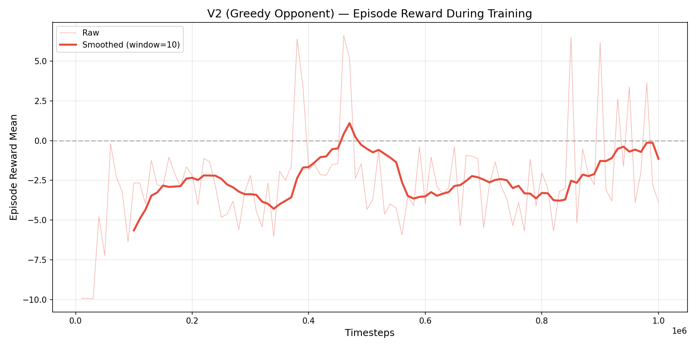
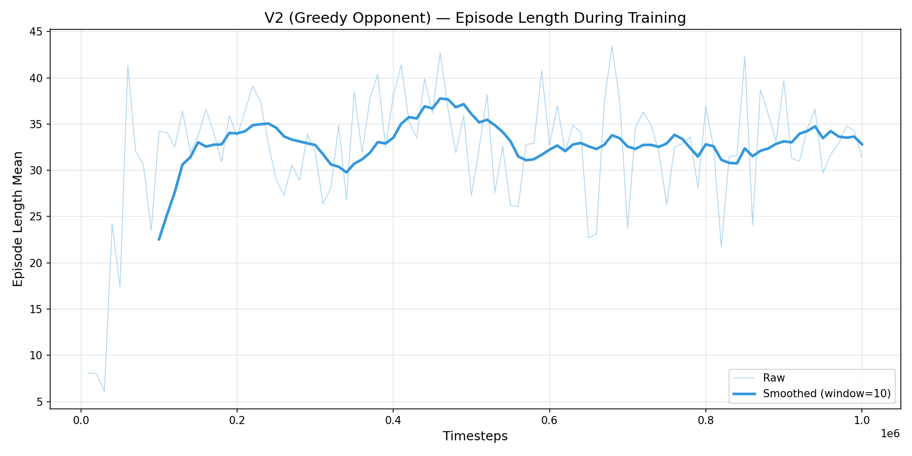
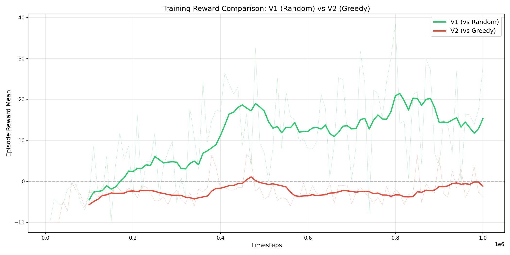

# PPO V2 Training Report: Greedy Opponent Experiment

**Project**: IFT6759 Splendor RL Agent  
**Experiment**: Experiment 1 — PPO Score-Based with Greedy Opponent  
**Date**: 2026-02-25 to 2026-02-26  
**Author**: Yehao Yan

---

## Executive Summary

This report details the results of **Experiment 1**: training the same PPO architecture against a **GreedyAgentBoost** opponent instead of a Random opponent (V1 baseline). The hypothesis was that a stronger training opponent would force the agent to develop more robust strategies.

**Result: Hypothesis Rejected.** The V2 agent trained against a Greedy opponent performed **dramatically worse** than V1 in all evaluation matchups, achieving only 3-7% win rates compared to V1's 43-53%. However, V2 made a surprising trade-off: it almost completely eliminated invalid actions (0.1/game vs V1's ~10+/game), suggesting it learned to play "safe" but ineffective moves.

**Key Findings**:
- :x: **Win Rate Collapse**: 3% vs Random (V1: 51%), 7% vs Greedy (V1: 53%)
- :heavy_check_mark: **Near-Zero Invalid Actions**: 0.1/game (V1: ~10+/game, 40-60% invalid rate)
- :x: **Training Reward Never Turned Positive**: Best eval reward was +6.62 (V1: +38.43)
- :warning: **High Draw Rate**: 20-34% of games ended in draws (0-0 scores), suggesting passive play
- :bulb: **Key Insight**: Without Action Masking, training against a hard opponent causes the agent to learn avoidance behavior rather than winning strategies

---

## 1. Experiment Design

### 1.1 Hypothesis

> **H1**: Training PPO against a stronger opponent (GreedyAgentBoost) instead of RandomAgent will produce an agent with more robust strategies that generalize better across different opponents.

### 1.2 Controlled Variables

| Parameter | V1 (Baseline) | V2 (This Experiment) | Changed? |
|-----------|---------------|----------------------|----------|
| **Opponent** | RandomAgent | GreedyAgentBoost(mode='event') | **YES** |
| Algorithm | PPO | PPO | No |
| Network | [256, 256, 128] | [256, 256, 128] | No |
| Learning Rate | 0.0003 | 0.0003 | No |
| Batch Size | 64 | 64 | No |
| n_steps | 2048 | 2048 | No |
| Total Timesteps | 1,000,000 | 1,000,000 | No |
| Reward Mode | score_progress | score_progress | No |
| State Dim | 135 | 135 | No |
| Action Space | Discrete(200) | Discrete(200) | No |
| Seed | 42 | 42 | No |

**Only the opponent was changed**, making this a clean controlled experiment.

### 1.3 Opponent Details

**GreedyAgentBoost (mode='event')**:
- Uses `StateEvaluatorHeuristic` with tuned weights from the original Splendor fork
- Evaluates all legal actions and picks the one maximizing a heuristic score
- Heuristic considers: card discounts, gem efficiency, noble progress, victory points
- Much stronger than random: consistently scores 10-15+ points per game
- `mode='event'` chosen over `mode='value'` for training speed (heuristic-based, no deep search)

**Config File**: `project/configs/training/ppo_score_based_v2_greedy_opp.yaml`

---

## 2. Training Process

### 2.1 Basic Information

| Metric | Value |
|--------|-------|
| **Start Time** | 2026-02-25 20:58:55 |
| **Total Timesteps** | 1,000,000 |
| **Training Speed** | ~71 FPS (avg) |
| **Final Model** | `project/logs/ppo_score_based_v2_greedy_opp_20260225_205855/final_model.zip` |
| **Checkpoints** | 20 (every 50K steps) |
| **Device** | CUDA (RTX 4090) |

### 2.2 Learning Curve Analysis

#### Episode Reward Evolution



| Timesteps | Episode Reward | Trend |
|-----------|----------------|-------|
| 10,000 | -9.93 ± 0.06 | :red_square: Initial — same as V1 |
| 40,000 | -4.77 ± 5.19 | :orange_square: First improvement |
| 60,000 | -0.20 ± 3.48 | :orange_square: Near zero |
| 130,000 | -1.25 ± 2.97 | :orange_square: Local best (early) |
| 380,000 | +6.39 ± 20.04 | :green_square: **First positive spike** |
| 460,000 | **+6.62 ± 21.00** | :green_square: **Peak performance** |
| 850,000 | +6.51 ± 20.84 | :green_square: Occasional wins |
| 1,000,000 | **-3.90 ± 5.65** | :red_square: **Final (negative)** |

**Critical Difference from V1**: V1 reached +27.99 mean reward at 1M steps. V2 never sustained positive rewards and finished at -3.90.

The occasional positive spikes (+6.39, +6.62) correspond to rare episodes where the agent won against the Greedy opponent (likely due to favorable card draws), but these were exceptions rather than learned behavior.

### 2.3 Episode Length Evolution



- **Initial**: ~8 steps (immediate failure)
- **Mid-term**: ~20-30 steps
- **Final**: 31.4 ± 17.0 steps

Comparable to V1's final episode length (~29.7), suggesting the agent learned basic game flow.

### 2.4 V1 vs V2 Training Comparison



The training comparison plot makes the divergence clear:
- **V1 (Green)**: Steadily climbs from -10 to +28, with peak at +38
- **V2 (Red)**: Oscillates around -2 to -5, never breaking through to sustained positive territory

### 2.5 Final Loss Metrics

```
approx_kl:            0.047  (V1: 0.024) — Higher KL = more aggressive updates
clip_fraction:        0.346  (V1: 0.111) — 3x clipping = unstable optimization
clip_range:           0.2    (same)
entropy_loss:         -1.56  (V1: -0.85) — Higher entropy = more random policy
explained_variance:   -0.167 (V1: 0.541) — NEGATIVE = value network worse than random
learning_rate:        0.0003 (same)
loss:                 0.861  (V1: N/A)
n_updates:            4,880  (same)
policy_gradient_loss: -0.045 (V1: -0.003) — Larger PG loss = more policy change
value_loss:           3.9    (V1: 99.7) — Lower because rewards are less variable
```

**Analysis**:
- **Explained Variance = -0.167**: The value network is **worse than a constant baseline**. It has not learned to evaluate states at all. This is the most damning metric — the agent cannot distinguish good states from bad ones.
- **Clip Fraction = 0.346**: Over 1/3 of updates are being clipped, indicating the policy is changing too rapidly between batches. This is a sign of training instability.
- **Entropy = -1.56**: Higher entropy than V1, suggesting the policy never converged to a clear strategy.

---

## 3. Evaluation Results

### 3.1 Summary Table (100 Games Each)

| Opponent | Mode | V2 Win Rate | V1 Win Rate | V2 Agent Score | V1 Agent Score |
|----------|------|-------------|-------------|----------------|----------------|
| Random (wrapper) | Fallback | **3.0%** | 51.0% | 1.9 ± 3.4 | 9.5 ± 7.6 |
| RandomAgent | Fallback | **3.0%** | 43.0% | 3.1 ± 4.2 | 9.0 ± 7.1 |
| GreedyAgent | Fallback | **7.0%** | 53.0% | 2.8 ± 4.7 | 10.1 ± 7.6 |
| Random (wrapper) | Strict | **2.0%** | 31.0% | 1.5 ± 3.2 | 5.2 ± 7.6 |

### 3.2 vs Random (Built-in, Fallback Mode)

| Metric | V2 | V1 |
|--------|----|----|
| Win/Loss/Draw | 3/63/34 | 51/49/0 |
| Win Rate | **3.0%** | **51.0%** |
| Agent Score | 1.9 ± 3.4 | 9.5 ± 7.6 |
| Opponent Score | 10.7 ± 8.0 | 6.5 ± 7.1 |
| Invalid Actions/game | **0.03** | ~10+ |
| Zero-actions episodes | **34** | ~20 |

### 3.3 vs RandomAgent (Fallback Mode)

| Metric | V2 | V1 |
|--------|----|----|
| Win/Loss/Draw | 3/69/28 | ~43/57/0 |
| Win Rate | **3.0%** | **43.0%** |
| Agent Score | 3.1 ± 4.2 | 9.0 ± 7.1 |
| Opponent Score | 11.6 ± 7.4 | 10.0 ± 6.6 |

### 3.4 vs GreedyAgent (Fallback Mode)

| Metric | V2 | V1 |
|--------|----|----|
| Win/Loss/Draw | 7/73/20 | ~53/47/0 |
| Win Rate | **7.0%** | **53.0%** |
| Agent Score | 2.8 ± 4.7 | 10.1 ± 7.6 |
| Opponent Score | 13.1 ± 7.3 | 7.0 ± 7.2 |

### 3.5 Invalid Action Comparison

| Metric | V2 | V1 |
|--------|----|----|
| Invalid actions per game | **0.03-0.11** | **~10+** |
| Games with invalid actions | 3-11% | ~100% |
| Fallback needed | 3-11 total across 100 games | Majority of actions |

**This is the one area where V2 dramatically outperforms V1.** The Greedy opponent training forced the agent to learn valid action selection, but at the cost of learning *effective* actions.

---

## 4. Analysis & Root Cause

### 4.1 Why Did V2 Fail?

**Root Cause: Reward Signal Collapse Against a Strong Opponent**

When training against a Greedy opponent without Action Masking:

1. **The agent rarely wins** → The +50 win bonus is almost never received → The agent has almost no positive reward signal to learn from.

2. **The agent learns to survive, not to win** → The only consistent reward is the +0.01/step survival bonus → This incentivizes playing long games with safe (but useless) actions.

3. **Conservative action selection** → The agent learned to pick actions that are always valid (likely gem collection actions which are almost always legal), rather than risky but rewarding card purchases.

4. **Value network failure** → Explained variance of -0.167 means the critic cannot evaluate states properly. Without a working critic, the policy receives noisy gradient signals.

### 4.2 The "Safe But Useless" Trap

V2's behavior pattern reveals a classic RL failure mode:

```
V1 (vs Random): Takes many actions → Many invalid → But also many SCORING actions → Learns to score
V2 (vs Greedy): Takes few actions → Almost all valid → But very few SCORING actions → Never learns to score
```

The Greedy opponent punishes the agent so severely that it enters a **local minimum of passive play**: collecting gems endlessly without ever buying cards, resulting in 0-0 draw games (34% of games end this way).

### 4.3 The Zero-Actions Problem

**20-37% of games ended with "zero legal actions"** — meaning the agent ran into a state where no actions were available. This is likely caused by:
- Excessive gem hoarding (hitting the 10-gem cap with no useful gems)
- Board state exhaustion (all affordable cards bought by opponent)
- A potential edge case in the Splendor engine when a player has too many tokens

### 4.4 Why V1 Succeeded Where V2 Failed

Against a **Random opponent**:
- Random makes many suboptimal moves, giving the PPO agent "breathing room" to explore
- The agent occasionally wins by accident early in training → positive reward signal → bootstrapping begins
- The win bonus (+50) is received frequently enough to shape the policy

Against a **Greedy opponent**:
- Greedy rarely makes mistakes → PPO agent almost never wins
- The only positive signal is +0.01/step → agent optimizes for game length, not score
- No virtuous cycle of winning → better strategy → more winning

---

## 5. Lessons Learned

### 5.1 Key Takeaways

1. **Opponent difficulty must match agent capability**: Training against a too-strong opponent without curriculum learning causes reward collapse. The agent needs to *occasionally win* to learn what winning looks like.

2. **Action Masking is prerequisite for hard opponents**: Without it, the agent's first learning objective (valid action selection) consumes all capacity, leaving nothing for strategic learning.

3. **The +0.01/step survival bonus is dangerous**: It creates a perverse incentive to play passively when winning is impossible. Future reward designs should include penalties for low scores at game end.

4. **Explained variance is a critical diagnostic**: V1's 0.541 vs V2's -0.167 is the clearest indicator of training quality. Negative explained variance = the training has failed.

5. **Clip fraction > 0.3 is a red flag**: V2's 0.346 vs V1's 0.111 indicates the learning rate was too aggressive for the harder problem.

### 5.2 Recommendations for Future Experiments

| Approach | Priority | Expected Impact |
|----------|----------|-----------------|
| **Action Masking (MaskablePPO)** | **Critical** | Eliminates invalid action problem entirely, freeing capacity for strategy |
| **Curriculum Learning** | High | Start with Random, gradually increase opponent difficulty |
| **Self-Play** | High | Agent always faces opponent of similar strength |
| **Reward Redesign** | Medium | Penalize 0-score games, remove survival bonus |
| **Lower Learning Rate for hard opponents** | Medium | Reduce clip fraction, stabilize training |
| **Longer Training** | Low | Unlikely to help without above fixes |

### 5.3 Experiment Verdict

| Criterion | Result |
|-----------|--------|
| H1: Stronger opponent → better generalization | **REJECTED** |
| Training converged? | No (explained_variance < 0) |
| Better than V1 in any matchup? | No |
| Any positive insight? | Yes: V2 learned valid action selection |
| Worth continuing V2 training? | No — fundamental approach is flawed |
| Next experiment priority | **MaskablePPO + Action Masking** |

---

## 6. V1 vs V2 Head-to-Head Comparison

### 6.1 Performance Summary

| Metric | V1 (Random Opp) | V2 (Greedy Opp) | Winner |
|--------|------------------|------------------|--------|
| vs Random Win Rate | 51% | 3% | **V1** |
| vs RandomAgent Win Rate | 43% | 3% | **V1** |
| vs Greedy Win Rate | 53% | 7% | **V1** |
| Invalid Actions/Game | ~10+ | 0.03-0.11 | **V2** |
| Final Training Reward | +27.99 | -3.90 | **V1** |
| Explained Variance | 0.541 | -0.167 | **V1** |
| Peak Training Reward | +38.43 | +6.62 | **V1** |
| Max Agent Score | 22 | 22 | Tie |
| Median Agent Score | ~8-10 | 0-1 | **V1** |

### 6.2 Decision

**V1 remains the best model.** V2 provided valuable negative results that inform our Phase 2 approach:
- Action Masking is not optional — it's prerequisite
- Curriculum learning is needed before escalating opponent difficulty
- Reward shaping alone cannot compensate for the action space problem

---

## 7. Impact on Project Plan

### 7.1 Updated Phase 2 Priority

Based on V2's results, the Phase 2 plan is reordered:

1. **Step 1 (Critical)**: Implement `MaskablePPO` with action mask output from `SplendorGymWrapper`
2. **Step 2**: Re-run V1 experiment (Random opponent) with MaskablePPO — expect >70% win rate
3. **Step 3**: Re-run V2 experiment (Greedy opponent) with MaskablePPO — expect meaningful learning
4. **Step 4**: Implement curriculum learning (Random → Greedy → Self-play)
5. **Step 5**: Event-based reward shaping (original Phase 2 plan)

### 7.2 Expected Timeline

- MaskablePPO implementation: 2-3 hours
- MaskablePPO + Random training: 1 hour
- MaskablePPO + Greedy training: 1 hour
- Evaluation & comparison: 30 minutes

---

## Appendix

### A. Training Log Milestones

**All eval checkpoints (selected)**:
```
Step      | Reward          | Trend
10,000    | -9.93 ± 0.06   | Starting (same as V1)
40,000    | -4.77 ± 5.19   | First improvement
60,000    | -0.20 ± 3.48   | Near zero
130,000   | -1.25 ± 2.97   | Local best (early)
380,000   | +6.39 ± 20.04  | First positive (won 1 game)
460,000   | +6.62 ± 21.00  | Best eval reward (peak)
850,000   | +6.51 ± 20.84  | Late spike (won 1 game)
1,000,000 | -3.90 ± 5.65   | Final (regression)
```

### B. File References

**Training Artifacts**:
```
project/logs/ppo_score_based_v2_greedy_opp_20260225_205855/
├── final_model.zip              # Final Model
├── config.yaml                  # Training Config
├── logs/
│   ├── tensorboard/             # TensorBoard Logs
│   └── checkpoints/             # 20 Checkpoints (50K-1M)
├── eval/                        # Eval data
└── monitor/                     # Episode monitor
```

**Evaluation Results**:
```
project/experiments/evaluation/ppo_score_based_v2_eval/
└── eval_v3_20260226_083927.json
```

**Training Log**: `project/logs/training_v2.log`

### C. Config File
```yaml
experiment:
  name: ppo_score_based_v2_greedy_opp
  notes: >
    Controlled experiment: same reward and hyperparams as v1 but trains against
    GreedyAgentBoost instead of random.
environment:
  opponent: greedy
  reward_mode: score_progress
  max_turns: 120
ppo:
  learning_rate: 0.0003
  batch_size: 64
  n_steps: 2048
  policy_kwargs:
    net_arch: [256, 256, 128]
training:
  total_timesteps: 1000000
seed: 42
```

---

**Report Date**: 2026-02-26  
**Version**: 1.0  
**Conclusion**: Experiment 1 (Greedy Opponent) produced a **negative result** that is valuable for project direction. Action Masking is confirmed as the #1 priority for Phase 2.
